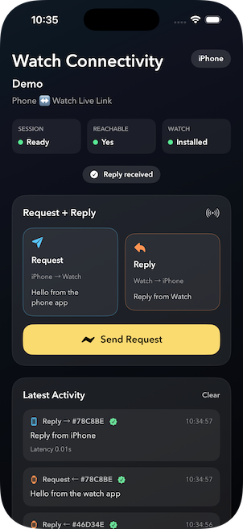
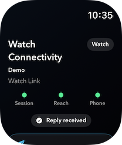

# ConnectivityBridge

ConnectivityBridge is a **Swift Package** that provides a typed request/response bridge on top of **WatchConnectivity**. It ships with a **fully working iOS + watchOS demo app** so you can run the code on simulators or real devices and see the communication flow end-to-end.

## Add The Package (SPM)

Add ConnectivityBridge to your `Package.swift`:

```swift
dependencies: [
    .package(url: "https://github.com/davidthorn/ConnectivityBridge.git", from: "0.1.0")
],
targets: [
    .target(
        name: "YourApp",
        dependencies: [
            .product(name: "ConnectivityBridge", package: "ConnectivityBridge")
        ]
    )
]
```

## Why This Exists

This project is both a library and a teaching tool. It shows:

- How to **package WatchConnectivity infrastructure** as a reusable Swift Package.
- A clear, visual **request → reply** flow on both phone and watch.
- A typed request/response bridge (`TypedConnectivityBridge`) with **timeouts**.
- A simpler transport bridge (`WatchConnectivityBridge`) for raw WatchConnectivity plumbing.
- How to **pair iOS and watchOS simulators** and test the bridge end-to-end.

## Who It’s For

- iOS/watchOS developers who want a **Swift Package** for WatchConnectivity messaging.
- People recording **tutorials** or onboarding new team members.
- Anyone who wants a **clean base** for WatchConnectivity experiments.

## Package vs Demo

- **ConnectivityBridge (Swift Package)**: The reusable bridge you can import into any iOS/watchOS app.
- **Demo App (iOS + watchOS)**: A fully working example that visualizes request/reply flow, status, and latency.

The demo lives alongside the package so you can learn the API and see it working in real time.

## Screenshots

**iPhone**



**Watch**



## Quickstart

Minimal setup that mirrors how the demo uses the bridge:

```swift
let bridge = TypedConnectivityBridge<BridgeMessage, BridgeMessage>(
    transport: WatchConnectivityBridge.shared
)

bridge.connect()

Task {
    let events = await bridge.events()
    for await event in events {
        print(event)
    }
}

Task {
    let requests = await bridge.requests()
    for await request in requests {
        let reply = BridgeMessage(text: "Pong", origin: "Watch", id: request.id)
        await bridge.reply(to: request.id, with: reply)
    }
}
```

## TypedConnectivityBridge: How It Works

`TypedConnectivityBridge<Request, Response>` handles typed request/response flows with correlation IDs and timeouts. It wraps payloads internally so replies can be matched to requests safely.

### Send Without Reply

Use `send(_:)` when you do **not** expect a response.

```swift
let bridge = TypedConnectivityBridge<BridgeMessage, BridgeMessage>(
    transport: WatchConnectivityBridge.shared
)

let message = BridgeMessage(text: "One-way ping", origin: "iPhone")
await bridge.send(message)
```

### Send With Reply + Timeout

Use `request(_:timeout:)` when you **need a reply**. If the reply doesn’t arrive before the timeout, the call throws.

```swift
let bridge = TypedConnectivityBridge<BridgeMessage, BridgeMessage>(
    transport: WatchConnectivityBridge.shared
)

let request = BridgeMessage(text: "Ping?", origin: "iPhone")
let reply = try await bridge.request(request, timeout: .seconds(2))
print("Reply: \(reply.text)")
```

### Handling Incoming Requests

Listen for incoming requests and reply explicitly. The bridge will match the response to the original request.

```swift
Task {
    let requests = await bridge.requests()
    for await req in requests {
        let reply = BridgeMessage(text: "Pong", origin: "Watch", id: req.id)
        await bridge.reply(to: req.id, with: reply)
    }
}
```

## WatchConnectivityBridge: How It Works

`WatchConnectivityBridge` is the low-level transport layer. It exposes a typed stream of `ConnectionSnapshot<T>` so you can observe state and payloads.

### Stream Typed Messages

```swift
let transport = WatchConnectivityBridge.shared
transport.connect()

Task {
    let stream = await transport.stream(as: BridgeMessage.self)
    for await snapshot in stream {
        if let received = snapshot.received {
            print("Received: \(received.text)")
        }
    }
}
```

### Send a Typed Payload

```swift
let transport = WatchConnectivityBridge.shared
let payload = BridgeMessage(text: "Hello", origin: "iPhone")
await transport.send(payload)
```

## Simulator Setup (Quick)

- Open the demo app project and run **both** the iOS app and the watchOS app.
- Use **Xcode → Device and Simulators** to ensure the watch simulator is paired with your phone simulator.
- When paired, the UI shows **Connected / Reachable** and requests begin to succeed.

## Notes

- The UI is intentionally verbose so it can be shown in tutorials without narration.
- The “Latest Activity” section is a full log with timestamps, direction, and request IDs.
